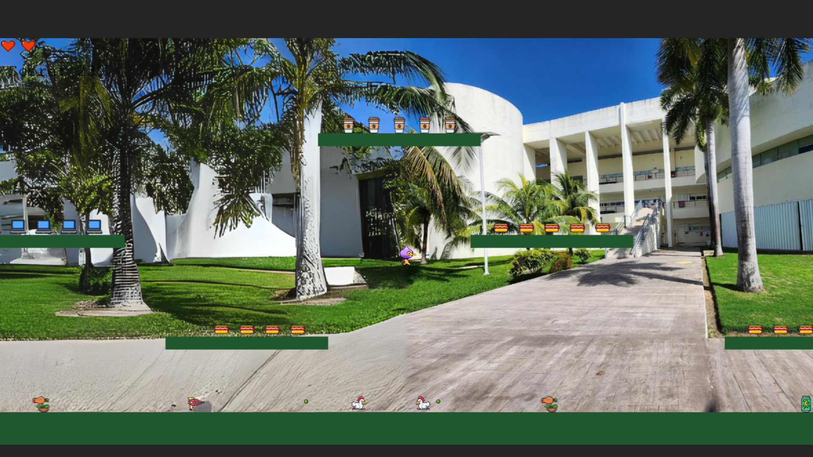
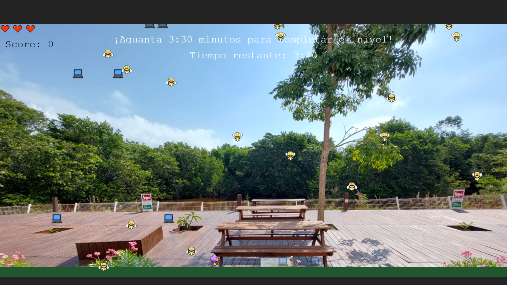

# Leap of Legends

**Leap of Legends** es un juego de plataformas desarrollado con **React** y **Phaser**. El objetivo del juego es guiar a tu personaje a través de diferentes niveles, recolectando estrellas y diamantes, evitando enemigos, y alcanzando la meta final con la mayor puntuación posible.

## Características del juego

- **Varios niveles:** Selecciona y juega en cinco niveles diferentes con desafíos únicos.
- **Enemigos dinámicos:** Los enemigos se mueven a lo largo del nivel y pueden ser derrotados al saltar sobre ellos.
- **Recolección de objetos:** Recoge estrellas y diamantes para incrementar tu puntuación.
- **Barra de vida:** Administra la vida de tu personaje mientras enfrentas enemigos.
- **Diseño responsivo:** La interfaz del juego se adapta a diferentes tamaños de pantalla.

## Capturas de pantalla

### Nivel 1 - Edificio de C (SAC)



### Nivel 2 - Edificio de G (Ingenierías)



## Tecnologías utilizadas

- **React**: Para la interfaz de usuario y la navegación de la aplicación.
- **Vite**: Herramienta de construcción rápida para proyectos de React.
- **Phaser**: Un motor de juegos en 2D utilizado para crear la jugabilidad.

## Instrucciones para iniciar el proyecto

Antes de iniciar, asegúrate de tener instalado lo siguiente:

- [Node.js](https://nodejs.org/en/)
- [npm](https://www.npmjs.com/)
- [Git](https://git-scm.com/)

Puedes verificar las instalaciones con los siguientes comandos:

```bash
node --version
npm --version
git --version
```

### 1. Hacer un fork del repositorio

Para comenzar a trabajar en el proyecto, haz un **fork** del repositorio original en tu cuenta de GitHub. Esto te permitirá trabajar en tu propia copia del proyecto sin afectar el repositorio original.

1. Ve al repositorio: [https://github.com/marcosd59/leap-of-legends](https://github.com/marcosd59/leap-of-legends)
2. Haz clic en el botón **Fork** (ubicado en la parte superior derecha) para crear una copia del repositorio en tu cuenta de GitHub.

### 2. Clonar el repositorio desde tu fork

Ahora clona el repositorio desde tu **fork** en tu máquina local. Abre tu terminal o línea de comandos y ejecuta el siguiente comando (reemplaza `tu-usuario` con tu nombre de usuario de GitHub):

```bash
git clone https://github.com/tu-usuario/leap-of-legends.git
```

Este comando descargará una copia del proyecto en tu directorio actual.

### 3. Navegar al directorio del proyecto

Una vez que hayas clonado el repositorio, navega al directorio del proyecto:

```bash
cd leap-of-legends
```

### 4. Crear una nueva rama para tu nivel

Antes de realizar cualquier cambio, crea una nueva rama para desarrollar tu nivel. Por ejemplo, si estás creando un nivel llamado "Océano", puedes crear una rama llamada `nivel-2-oceano`:

```bash
git checkout -b nivel-2-oceano
```

Este comando creará una nueva rama y te cambiará a esa rama para que puedas empezar a trabajar.

### 5. Instalar las dependencias de Node.js

Antes de ejecutar el proyecto, asegúrate de tener **Node.js** y **npm** instalados en tu sistema. Si no los tienes, puedes descargarlos desde [Node.js](https://nodejs.org/).

Para instalar las dependencias necesarias para ejecutar el proyecto, ejecuta:

```bash
npm install
```

Esto instalará todas las dependencias que están listadas en el archivo `package.json`, incluyendo **React**, **Phaser**, y otras bibliotecas.

### 6. Iniciar el proyecto

Una vez que las dependencias estén instaladas, puedes iniciar el servidor de desarrollo de **Vite** con el siguiente comando:

```bash
npm run dev
```

Este comando iniciará un servidor local y te proporcionará una URL (normalmente `http://localhost:5173`) donde podrás ver el juego en tu navegador.

Aquí tienes la sección actualizada con los detalles adicionales para que los desarrolladores agreguen nuevos enemigos, armas, poderes, ítems y música, sin repetir elementos del nivel 1 pero reutilizando funciones existentes como `gameOver` o `reachGoal`:

### 7. Realizar cambios y desarrollar tu nivel

Ahora puedes comenzar a trabajar en tu nivel en la rama `nivel-2-oceano`. Asegúrate de hacer todos los cambios necesarios para que tu nivel sea único, pero al mismo tiempo mantén consistencia con el resto del juego.

#### Recomendaciones para desarrollar tu nivel

- **Agregar nuevos enemigos:** Crea enemigos que sean exclusivos de tu nivel para ofrecer nuevos desafíos. Puedes agregar nuevos sprites para los enemigos y definir sus comportamientos. Ejemplo: Un enemigo que dispare proyectiles o tenga un patrón de movimiento diferente.
- **Incorporar nuevas armas:** Introduce nuevas armas o formas de ataque que el jugador pueda utilizar. Asegúrate de que estas armas sean útiles en el contexto de tu nivel. Podrías reutilizar la lógica existente para armas (como las pistolas) y adaptarla a tu nuevo arsenal.

- **Añadir nuevos poderes y power-ups:** Puedes incluir nuevos poderes como invulnerabilidad temporal, salto doble o mayor velocidad. Utiliza las funciones de `collectPowerUp` y personalízalas para tu nivel.

- **Incluir nuevos ítems:** Introduce ítems coleccionables únicos (por ejemplo, perlas o tesoros si tu nivel es acuático) que aumenten el puntaje del jugador.

- **Añadir música original:** Asegúrate de agregar música de fondo nueva para tu nivel. Evita repetir la música utilizada en otros niveles, incluida la del nivel 1. Puedes cargar nuevos archivos de audio en la función `preload`.

#### Importante

- **No repetir elementos del nivel 1:** Los enemigos, armas, ítems y poderes de tu nivel deben ser diferentes a los del nivel 1 para crear una experiencia fresca y variada para el jugador.
- **Reutilizar funciones existentes:** Aunque debes introducir elementos nuevos, puedes reutilizar funciones ya implementadas en el juego. Por ejemplo, puedes aprovechar las funciones de `loseLife`, `gameOver` y `reachGoal` sin necesidad de reescribirlas. Estas funciones ya gestionan correctamente el fin del juego o la victoria, así que simplemente úsalas para tu nivel.

- **Probar el nivel localmente:** No olvides probar el nivel en tu servidor local para asegurarte de que todos los elementos funcionan correctamente. Verifica que la física, los enemigos y los ítems interactúan bien con el jugador.

Con estos cambios, estarás contribuyendo a la creación de un nivel único que mantiene coherencia con el juego pero introduce nuevos retos y elementos para el jugador.

### 8. Hacer commit de tus cambios

Una vez que hayas terminado de trabajar en tu nivel, guarda tus cambios con un **commit**:

```bash
git add .
git commit -m "Añadido nivel 2: Océano"
```

### 9. Subir los cambios a tu fork en GitHub

Sube los cambios a tu repositorio en GitHub usando el siguiente comando:

```bash
git push origin nivel-2-oceano
```

### 10. Crear un pull request

Finalmente, ve a tu repositorio en GitHub y verás un mensaje que te permitirá crear un **pull request** para que tus cambios sean revisados e integrados en el repositorio original.

1. Haz clic en **Compare & pull request**.
2. Añade una descripción detallada de los cambios que has realizado.
3. Envía la solicitud para que el administrador del repositorio revise e integre tus cambios.

## Contacto

Si tienes alguna pregunta o sugerencia, no dudes en abrir un issue o contactar al desarrollador:

- **Nombre**: Marcos D. Pool
- **Correo electrónico**: <damian.marcospool@gmail.com>
- **GitHub**: [marcosd59](https://github.com/marcosd59)
